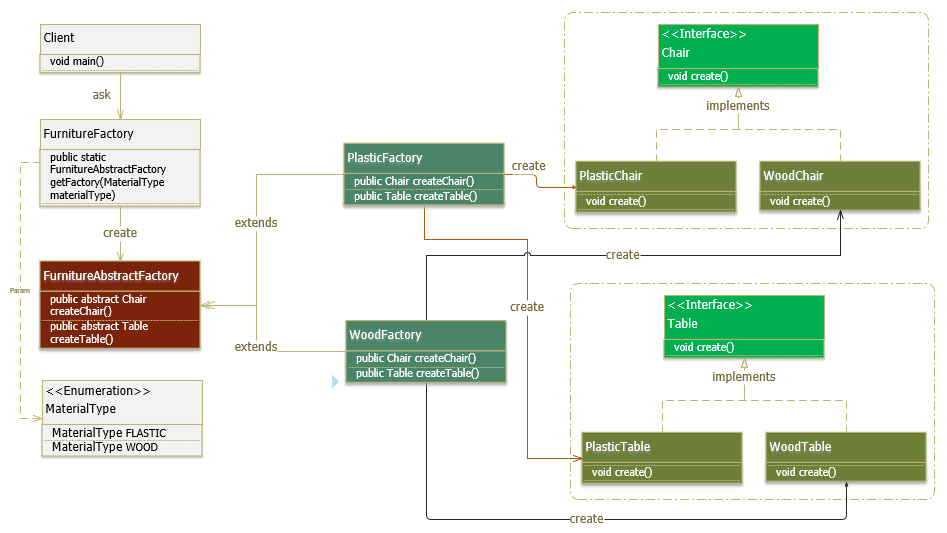

# Java

## Table of Content
1. [OOP Principles](#oop-principles)
2. [Design Patterns](#design-pattern)

#
## OOP Principles
There are 4 main principles for OOP:
    1. Encapsulation
    2. Abstraction
    3. Polymorphism
    4. Inheritance

#
## Design Patterns
Hiện tại có 23 mẫu được chia thành 3 nhóm:
1. [Creational Pattern](#creational-pattern): Cung cấp giải pháp để tạo ra object và che giấu đi logic của việc tạo object. Điều này giúp cho chương trình trở nên mềm dẻo trong việc quyết định object nào cần tạo ra trong những tình huống được đưa ra.

2. [Structural Pattern](#structural-pattern): Dùng để thiết lập, định nghĩa mối quan hệ giữa các object.

3. [Behavioral Pattern](#behavioral-pattern): Dùng trong thực hiện các hành vi của object và cách giao tiếp giữa các object.

### Creational Pattern

1. Singleton

2. Factory Method
    - Definition: Định nghĩa Interface để sinh ra đối tượng nhưng để cho lớp con quyết định lớp nào được dùng để sinh ra đối tượng.
    

3. Abstract Factory
    - Abstract factory như là một nhà máy lớn chứa nhiều nhà máy nhỏ.
    

4. Builder
    - Definition: Phân tách việc xây dựng một đối tượng phức tạp ra khỏi thể hiện của nó và sử dụng tiếp cận từng bước, do đó cùng một tiến trình xây dựng có thể tạo ra các biểu diễn khác nhau.

    

5. Prototype
    - Definition: dùng một đối tượng mẫu, tạo mới nhờ vào sao chép đối tượng mẫu này.

    

### Structural Pattern

6. Adapter

7. Bridge

8. Composite

9. Decorator
    - Definition: Cho phép người dùng thêm chức năng mới vào đối tượng hiện tại mà không muốn ảnh hưởng đến các đối tượng khác.

    

    - Component (EmployeeComponent): là một interface quy định chung cần có trong tất cả các thành phần tham gia
    - ConcreteComponent (EmployeeConcreteComponent): là lớp implements các phương thức của Component.
    - Decorator (EmployeeDecorator): là một abstract class dùng để duy trì tham chiếu của đối tượng Component và đồng thời implements các phương thức của Component.
    - ConcreteDecorator (TeamMember, TeamLeader, Manager): là lớp extends Decorator, implements các phương thức của Decorator và cài đặt thêm các tính năng mới cho Component.

10. Facade
    - Definition: Cung cấp một giao diện chung đơn giản thay cho một nhóm các giao diện có trong subsystem. Facade Pattern định nghĩa một giao diện ở một cấp độ cao cấp hơn để giúp con người dùng có thể dễ dàng sử dụng subsystem.

    

11. Flyweight
    - Definition: Sử dụng việc chia sẻ để thao tác hiệu quả trên một số lượng lớn đối tượng

12. Proxy
    - Definition: Cung cấp đối tượng đại diện cho đối tượng khác để kiểm soát quá trình truy cập đối tượng đó.

    

### Behavioral Pattern

13. Chain of Responsibility
    - Definition: Khắc phục việc ghép cặp giữa bộ gởi và bộ nhận thông điệp. Các đối tượng nhận thông điệp được kết nối thành một chuỗi và thông điệp được chuyển dọc theo chuỗi này đến khi gặp được đối tượng xử lý nó. Tránh việc gắn kết cứng giữa phần tử gởi request với phần tử nhận và xử lý request bằng cách cho phép hơn 1 đối tượng có có cơ hội xử lý request.

    
14. Command
    - Definition: Sử dụng Command Object như một class trung gian để lưu trữ các câu lệnh và trạng thái của object tại một thời điểm nào đó. Command Pattern cho phép tất cả những request gửi đến object được lưu trữ trong Command Object.

    

15. Iterator
    - Denifition: Truy xuất các phần tử của đối tượng dạng tập hợp (list, array, ...) mà không phụ thuộc vào biểu diễn bên trong của các phần tử.
    - Cung cấp một cách thức truy cập tuần tự tới các phần tử của một đối tượng tổng hợp, mà không tiết lộ biển diễn bên trong.

    

    - ConcreteAggregate (Menu): Nó cài đặt interface tạo Iterator để trả về một thể hiện của ConcreteIterator thích hợp.
    - Iterator (ItemIterator): là một interface hay abstract class, định nghĩa các phương thức để truy cập và duyệt qua các phần tử.
    - ConcreteIterator (MenuItemIterator): cài đặt các phương thức của Iterator, giữ index khi duyệt qua các phần tử.

16. Mediator
17. Memento
18. Observer
    - Definition: Định nghĩa sự phụ thuộc một hoặc nhiều chiều giữa các đối tượng sao cho khi một đối tượng thay đổi trạng thái thì tất cả các đối tượng phụ thuộc nó cũng thay đổi theo.
    - Observer có thể đăng ký với hệ thống. Khi hệ thống có sự thay đổi, hệ thống sẽ thông báo cho Observer biết. Khi không cần nữa, mẫu Observer sẽ được gỡ khỏi hệ thống.

    

    - Subject : cung cấp các phương thức để thêm, loại bỏ, thông báo observer.
    - AccountService : đóng vai trò là ConcreteSubject, sẽ thông báo tới tất cả các observers bất cứ khi nào có thao tác của người dùng liên quan đến đăng nhập, tài khoản hết hạn.
    - Observer : định nghĩa một phương thức update() cho các đối tượng sẽ được subject thông báo đến khi có sự thay đổi trạng thái.
    - Logger, Mailer và Protector là các ConcreteObserver. Sau khi nhận được thông báo rằng có thao tác với user và gọi tới phương thức update(), các ConcreteObserver sẽ sử dụng dữ liệu SubjectState để xử lý.

19. State
20. Strategy
    - Definition: Định nghĩa một họ các thuật toán, đóng gói từng thuật toán và hoán đổi sử dụng giữa chúng. Strategy cho phép thuật toán biến đổi độc lập với người dùng.

    

    - Strategy: định nghĩa hành vi
    - ConcreteStrategy : cài đặt các hành vi cụ thể của Strategy.
    - Context (SortedList): chứa một tham chiếu đến đối tượng Strategy và nhận các yêu cầu từ Client, các yêu cầu này sau đó được ủy quyền cho Strategy thực hiện.

21. Template method

22. Vistor