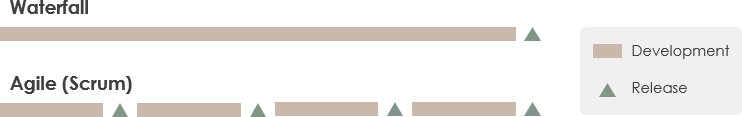

# Software Development Life Cycle (SDLC)

## Waterfall
### Definition
Waterfall approach was first SDLC Model to be used widely in Software Engineering to ensure success of the project. In "The Waterfall" approach, the whole process of software development is divided into separate phases. In this Waterfall model, typically, the outcome of one phase acts as the input for the next phase sequentially.

## Mô hình Agile

### Definition:
Agile breaks the product into smaller builds (sprints). Business, stakeholders, and developers and clients must work together to develop a product.

### Properties
1. __Iterative__:
    - Dự án sẽ được thực hiện trong các phân đoạn lặp đi lặp lại. Các phân đoạn (được gọi là Iteration hoặc Sprint) này thường có khung thời gian ngắn (từ một đến bốn tuần).
2. __Incremental & Evolutinoary__:
    - Cuối các phân đoạn, nhóm phát triển thường cho ra các phần nhỏ của sản phẩm cuối cùng. Các phần nhỏ này thường là đầy đủ, có khả năng chạy tốt, được kiểm thử cẩn thận và có thể sử dụng ngay (gọi là potentially shippable product increment of functionality). Theo thời gian, phân đoạn này tiếp nối phân đoạn kia, các phần chạy được này sẽ được tích lũy, lớn dần lên cho tới khi toàn bộ yêu cầu của khách hàng được thỏa mãn.

    - Khác với mô hình phát triển Thác nước – vốn chỉ cho phép nhìn thấy toàn bộ các chức năng tại thời điểm kết thúc dự án, sản phẩm trong các dự án agile lớn dần lên theo thời gian, tiến hóa cho tới khi đạt được trạng thái đủ để phát hành.
3. __Adaptive__:
    - Do các phân đoạn chỉ kéo dài trong một khoảng thời gian ngắn, và việc lập kế hoạch cũng được điều chỉnh liên tục, nên các thay đổi trong quá trình phát triển (yêu cầu thay đổi, thay đổi công nghệ, thay đổi định hướng về mục tiêu v.v.) đều có thể được đáp ứng theo cách thích hợp . Ví dụ, trong Scrum – phương pháp phổ biến nhất hiện nay – trong khi nhóm phát triển sản xuất ra các gói phần mềm, khách hàng có thể đưa thêm các yêu cầu mới, chủ sản phẩm (Product Owner) có thể đánh giá các yêu cầu này và có thể đưa vào làm việc trong phân đoạn (được gọi là Sprint trong Scrum) tiếp theo. Theo đó, các quy trình agile thường thích ứng rất tốt với các thay đổi.

#
## Quy trình Scrum

### Definition
Scrum is a Agile framework for project management that emphasizes teamwork, accountability and iterative progress toward a well-defined goal.

### Why Scrum
Scrum delivers features at a time, while waterfall simply delivers phases. A typical waterfall style development is phased-based and sequential process that will not give value until the very end the project. Scrum turns that model on its head and delivers new features every few weeks instead of focusing on a big release in the future.

By building iteratively and incrementally, companies are able to deliver customers the products and services they really need faster and more effectively. With Scrum, you can receive and incorporate customer feedback at the end of every small development cycles, which means your results get shaped by real-world use, not your assumptions. This makes it much easier to keep customers and key stakeholders closely involved and engaged.

### Scrum Process

