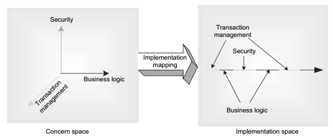
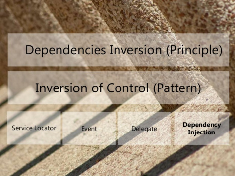

# Spring

## Table of Contents
1. [Fundamentals](#fundamentals)
2. [Spring Boot](#spring-boot)

## Fundamentals

1. What is Spring framework?

    Spring is one of the most widely used Java EE framework. Spring framework core concepts are “Dependency Injection (DI)” and “Aspect Oriented Programming (AOP)”.

2. What is Dependency Injection?

    Dependency Injection design pattern allows us to basically provide the objects that an object needs (its dependencies) instead of having it construct them itself. Dependency Injection makes our application loosely coupled, extendable and maintainable.

3. What is Aspect Orient Programming?

    AOP là một kỹ thuật lập trình cho phép phân tách chương trình thành cách module riêng rẽ, không phụ thuộc nhau. Khi hoạt động, chương trình sẽ kết hợp các module lại để thực hiện các chức năng nhưng khi sửa đổi chức năng thì chỉ cần sửa đổi trên một module cụ thể. Từ đó tăng tính uyển chuyển cho chương trình.

    

4. What is IoC?
    - Nguyên lý cuối cùng trong S-O-L-I-__D__ chính là __Dependency Inversion__:
        - Các module cấp cao không nên phụ thuộc vào các modules cấp thấp. Cả 2 nên phụ thuộc vào abstraction.
        - Interface (abstraction) không nên phụ thuộc vào chi tiết, mà ngược lại. ( Các class giao tiếp với nhau thông qua interface, không phải thông qua implementation.)
    
    

    - __IoC (Inversion of Control)__: một design pattern được tạo ra để code có thể tuân thủ nguyên lý Dependency Inversion. Cụ thể, là một quá trình trong đó một object định nghĩa ra những dependences của nó nhưng không tạo ra những dependeces đó.

    - __Dependency Injection__: Là một design pattern cụ thể hơn trong nhóm IoC.

5. What is IoC Container?

    IoC Container là nơi tạo ra các đối tượng, nối chúng lại với nhau, cấu hình chúng, và quản lý vòng đời của chúng từ khi tạo ra đến khi bị hủy. IoC Container sử dụng DI (Dependency Injection) để quản lý các thành phần tạo nên một ứng dụng. Những đối tượng này được gọi là __Spring Bean__.

6. What is Spring Bean?

    - Any normal java class that is initialized by Spring IoC container is called Spring Bean.
    - To define a Bean, we use _@Component_
    - Spring IoC container manages the life cycle of Spring Bean, bean scopes and injecting any required dependencies in the bean.

7. Scopes of Bean?
    - __Singleton__: Only one instance of the bean will be created for each container. This is the default scope for the spring beans.
    - __Prototype__: A new instance will be created every time the bean is requested.
    - __Request__: This is same as prototype scope, however it’s meant to be used for web applications. A new instance of the bean will be created for each HTTP request.
    - __Session__: A new bean will be created for each HTTP session by the container.
    - __Global-session__: This is used to create global session beans for Portlet applications.

8. Bean Life Cycle?

    Vòng đời của Bean trong Spring bao gồm khởi tạo, sử dụng và kết thúc.

9. Types of Spring Bean autowiring?
    - Autowire by Name
    - Autowire by Type
    - Autowire by Contructor
    - Autowiring by *@Autowired* and *@Qualifier* annotations
        - *@Qualifier* annotation is used to resolve the autowiring conflict, when there are multiple beans of same type. 

## Spring Boot
1. What is Spring boot?

    Spring Boot is a Spring module which aims to simplify the use of the Spring framework for Java development. It is used to a create stand-alone Spring-based applications which you can just run. Spring Boot framework comes with the auto-dependency resolution, embedded HTTP servers, auto-configuration, management endpoints, and Spring Boot CLI.

2. What is ORM, JPA, Hibernate?
    - __ORM (Obect-Relational Mapping)__ là một kỹ thuật/cơ chế lập trình thực hiện ánh xạ CSDL sang các đối tượng
    - __JPA (Java Persistence API)__ là 1 giao diện lập trình ứng dụng Java, nó mô tả cách quản lý các mối quan hệ dữ liệu  trong ứng dụng sử dụng Java. JPA cung cấp một mô hình POJO persistence cho phép ánh xạ các table/các mối quan hệ giữa các table trong database sang các class/mối quan hệ giữa các object.
    - __Hibernate__ là 1 ORM (Object Relational Mapping) framework cho phép người lập trình thao tác với database một cách hoàn toàn tự nhiên thông qua các đối tượng.
    

3. Mention the differences between JPA and Hibernate?

    | JPA (Java Persistence API) | Hibernate|
    |-----|----------|
    |JPA is a Data Access Abstraction used to reduce the amount of boilerplate code| Hibernate is an implementation/framework of JPA and offers benefits of loose coupling|

4. What’s the difference between @Component, @Controller, @Repository & @Service annotations in Spring?
    - __@Component__ is used to indicate that a class is a bean.
    - __@Controller__ is a specific type of bean, used in MVC applications and mostly used with RequestMapping annotation.
    - __@Repository__ annotation is used to indicate that a component is used as repository and a mechanism to store/retrieve/search data. We can apply this annotation with DAO pattern implementation classes.
    - __@Service__ is used to indicate that a class is a Service. Usually, the business facade classes that provide some services are annotated with this.

5. DispatcherServlet
